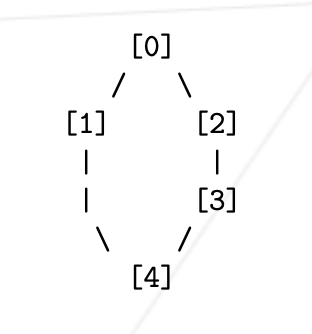

Example 1


```
// number_of_ants
// the_rooms
// the_links
// Lx-y Lz-w Lr-o ...
// x, z, r represents the ants’ numbers (going from 1 to number_of_ants) and y,
// w, o represents the rooms’ names.

3
##start
0 1 0
##end
1 5 0
2 9 0
3 13 0
0-2
2-3
3-1

L1-2
L1-3 L2-2
L1-1 L2-3 L3-2
L2-1 L3-3
L3-1
```

Example 2



```
2
1 0 2
##start
0 2 0
##end
4 2 6
2 4 2
3 4 4
0-1
0-2
2-3
3-4
4-1
L1-1
L1-4 L2-1
L2-4
```

Example 3

subject2-2.map
```
3
1 0 2
##start
0 2 0
##end
4 2 6
2 4 2
3 4 4
0-1
0-2
2-3
3-4
4-1
L1-1 L2-2
L1-4 L3-1 L2-3
L3-4 L2-4
```
